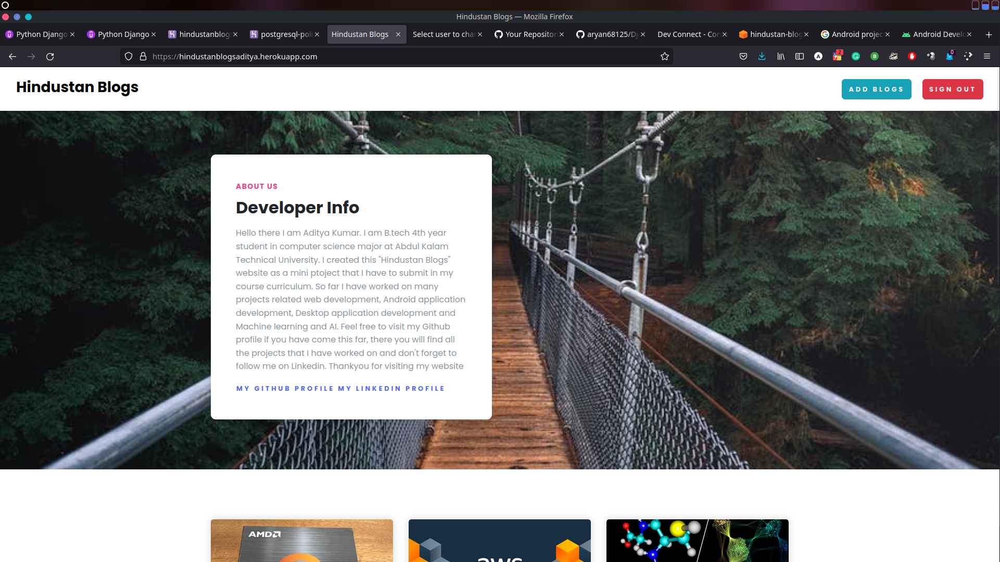
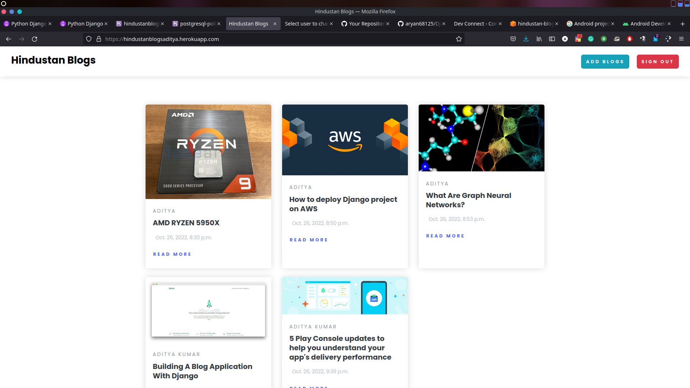
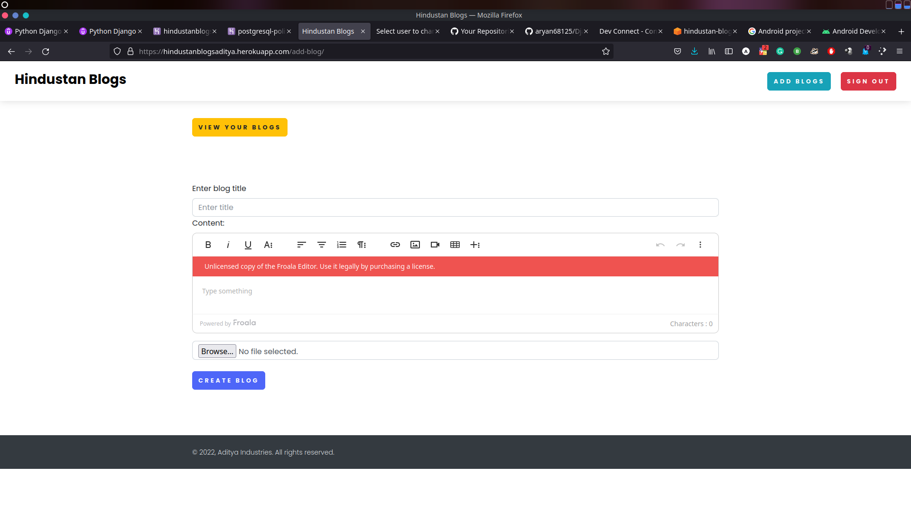
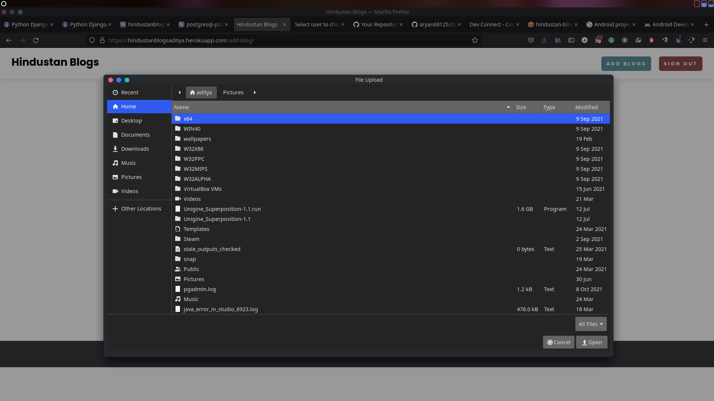
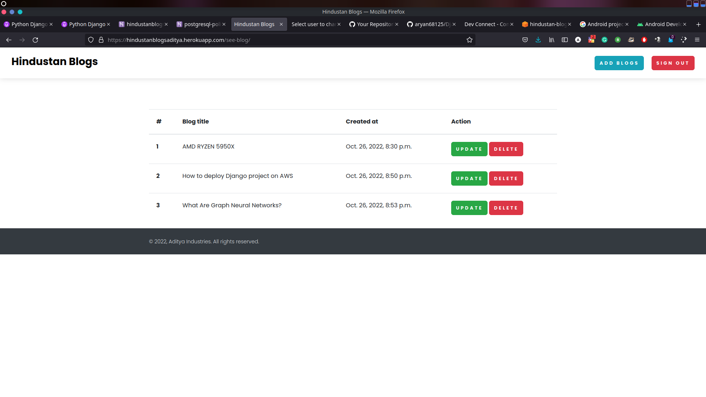
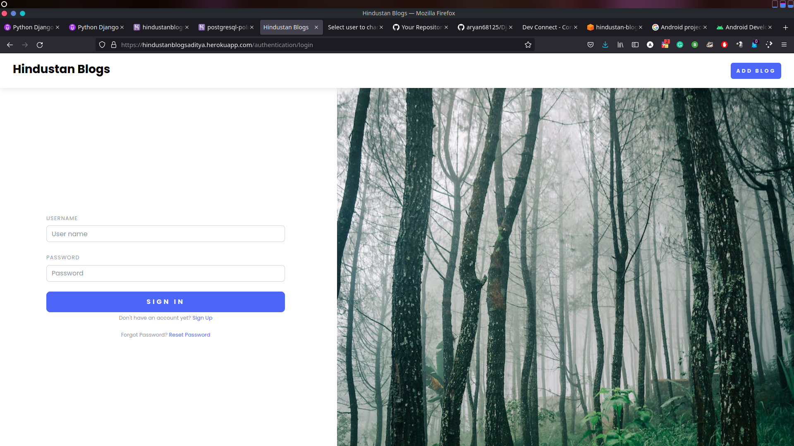
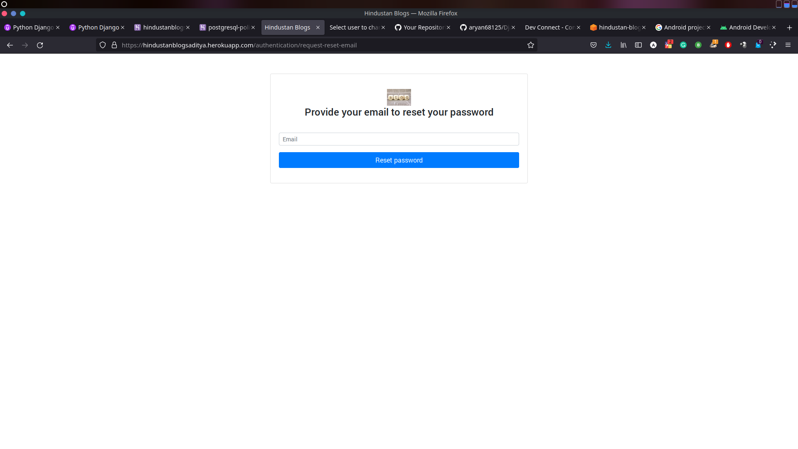

This is a Django blog application repo that holds Hindustan blogs website source code. Here in this website young fledgling bloggers can come and signup to this website and share their blogs on different topics to the rest of the world

here are some sample images :-








# Important NOTE :
### Don't forget to add this line in your AWS s3 bucket policy rules so that each and every object that is created inside this bucket has public access.
```

{
    "Version": "2012-10-17",
    "Statement": [
        {
            "Sid": "AllowPublicRead",
            "Effect": "Allow",
            "Principal": {
                "AWS": "*"
            },
            "Action": "s3:GetObject",
            "Resource": "arn:aws:s3:::your amazon s3 bucket name/*"
        }
    ]
}

```
